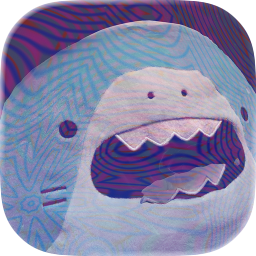

# Table of Contents

1.  [PippinVR](#org7f16d57)
2.  [About](#orgd98eb26)
    1.  [Capabilities](#org99c01cb)
3.  [Installation](#org9639605)
    1.  [Requirements](#org0ce0959)
        1.  [Pippin-VR Server](#org7925b9e)
        2.  [Pippin-VR Client](#orgee35afe)
4.  [Design](#orgb948b55)
    1.  [Known Issues](#org7f6f53b)
5.  [Contributing](#org9beed48)
6.  [License](#org2dc1f56)

> “We are stuck with technology when what we really want is just stuff that works.”  - Douglas Adams

# PippinVR

# About

This project was created out of the frustration that all MacOS VR virtual screen software (*Meta Quest Remote Desktop*, *Immersed*) are proprietary pieces of software. If I have code recording my screen, I want to know what it is actually doing.

`PippinVR` is named after the Apple Pippin, which itself was named after a relative to the McIntosh apple. The Apple Pippin was meant to be more than a platform just for game consoles, which is what I see VR to be as well.

This code is under the GNUv3 license as I feel strongly that any derivatives of this software should also be Open Source. Contributions are welcome and encouraged.

> "Given enough eyeballs, all bugs are shallow" - Eric S. Raymond (The Cathedral and the Bazaar)

## Capabilities

So far `PippinVR` can cast multiple screens from a Mac into a virtual space. It also has the ability to overlay the screens in passthrough, or cycle through settings with "B" (top button on a Meta Quest controller). The screens can be moved with the controller and placed individually. 

Menubar and taskbar icons are used so that you can easily shutoff the application when MacOS is stuck in virtual screen mode.

A settings menu can be used the configure the screens, with a default configuration file being placed in `ApplicationSupport` upon installation.

Dynamic framerate of each virtual screen conserves bandwidth using the wire. 

# Installation

This respsitory contains both the `PippinVR-Server`, the server running on MacOS, and `PippinVR-Client`, a client running on a Meta headset.
Because this code was created with wire transmission in mind, it makes use of Android Debug Bridge (adb) and SideQuest.

## Requirements

The following requirements are necessary for running `PippinVR`:

-   [MacOS Homebrew](https://brew.sh/)
-   [SideQuest](https://sidequestvr.com/setup-howto) (V 1.21)
-   Meta VR Headset (Quest 2, Quest 3, Quest 3s) in Developer Mode. (tested on the Meta Quest 3).
-   [Make](https://formulae.brew.sh/formula/make#default)
-   CMAKE ( [CMAKE.org](https://cmake.org/) or by [Homebrew](https://formulae.brew.sh/formula/cmake))
-   [Android Platform Tools](https://formulae.brew.sh/cask/android-platform-tools#default)
-   Xcode Command line tools (`xcode-select --install`)
-   [Swift](https://developer.apple.com/swift/) (V.60)
-   [Gradle](https://formulae.brew.sh/formula/gradle)
-   MacOS (tested on MacOS 26.6)

### Pippin-VR Server

This section is for the server aspect 
Make sure that `adb` is listening on the specifically bounded port for Pippin.

    adb reverse tcp:9943 tcp:9943

in the root directory of `PippinVR`, run the following command:

    make install-server-app

> [!NOTE]
> This installs `PippinVR.app` in the `/Applications` folders automatically. 

It should compile and install the server application as a \`.app\`. The first run will start the virtual screens and then quit out automatically. This is normal, as Pippin needs permission to record.

`PippinVR` works by recording whats called "Virtual" (non-physical) screens and then sending them to the headset to display. Because it is recording screens, MacOS requires permissions for screen recording. 

> [!NOTE]
> To configure Screen recording for PippinVR, the following needs to be configured:
>    `System Settings -> Privacy & Security -> Screen Recording`
> This setting needs to be changed  each time the app is recompiled.

Pippin-VR server has a settings menu that can be accessed from the menu bar. The settings menu allows changing the screen configurations while displaying to the headset. Displays can be added or removed, with instant refresh once the settings have been applied. 

### Pippin-VR Client

The client is what is run on the headset as an app, and is what displays the virtual screens in the headset.

To build and install the client on the headset, the following make command calls upon \`gradle\` to build the android components. The client is created in C++, and relies on the `CMAKELISTS.TXT` to pull and build required packages (SOIL2 and GLM).

    make install-client

> [!NOTE]
> Make sure a `local.properties` in `pippinVR-client` file contains \`sdk.dir\` and points to the android sdk. An example file called `local.properties.example` is provided.

# Design

The design of `PippinVR-server` is outlined as follows:

The server creates Virtual displays through the `CGVirtualDisplay`, sends it to the `VideoEncoder` and bundles it as an encoded frame to with a specific `StreamID` to send over the wire using the `MVRS` protocol. The frame data is encoded as big-endian, and decoded by the headset using stream identifiers.

Actor diagram for lifetimes of the client. Showcases the loop of frame encoding and sending to the headset to `FrameSink`.

## Known Issues

-   More than three screens has issues of collision, causing the fourth "virtual" screen becoming the Mac screen. This is being worked on.
-   Virtual Display positions are not saved after refresh/reboot.
-   Meta Quest remote polling sometimes stops working after wake.
-   Stale displays with old content will stay in the headset when the `PippinVR` app is disconnected.

# Contributing

Contributions are welcome and encouraged (as per the GNUv3 License). To contribute, make sure to use the `.pre-commit` file. To do so, make sure to install via [Homebrew](https://formulae.brew.sh/formula/pre-commit).

    pre-commit install

This project will take contributions in the form of pull-requests.

# License

GNU GENERAL PUBLIC LICENSE VERSION 3 (GNUv3).
